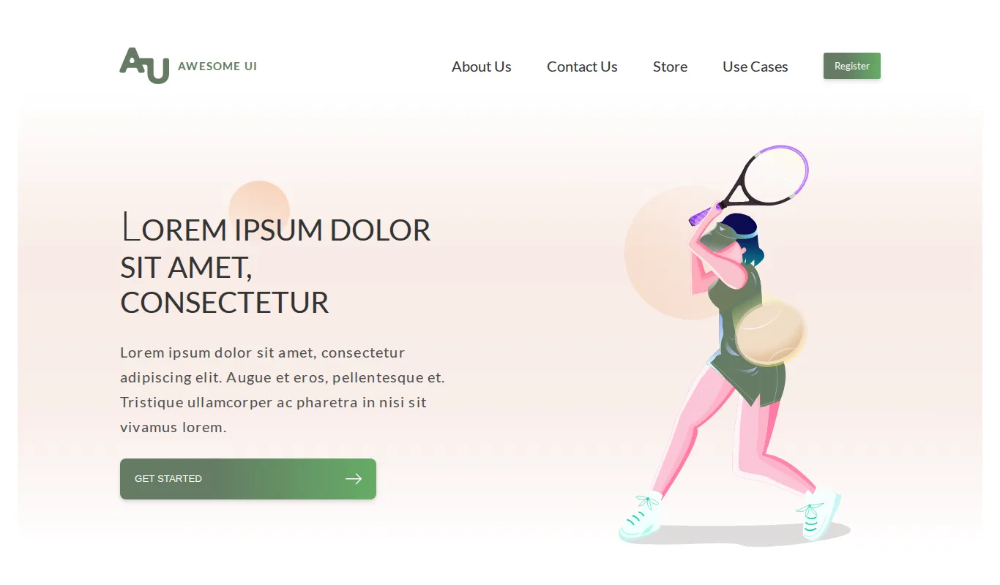

# Awesome UI

Vieno puslapio svetainės maketas, perkeltas į kodą su HTML, CSS ir JavaScript: CSS pratimas su gradientais, perėjimais ir prisitaikančiu išdėstymu.

**[Gyva versija](https://brutall100.github.io/awsome-ui/)** · **[Kodas](https://github.com/brutall100/awsome-ui)**



## Apie projektą

Tai mano CSS pratimas: tikslus dizaino maketo („Awesome UI“) perkėlimas į kodą be jokių karkasų. Puslapį sudaro šešios sekcijos (`.a-section` … `.f-section`) ir poraštė. Kiekviena sekcija bando kitokį išdėstymą arba animaciją.

## Funkcijos

- Kortelių ikonos pasikeičia užvedus pelę (žalia ↔ balta).
- Meniu telefone atsidaro ir užsidaro mygtuku.
- Atsiliepimai slenka į šonus rodyklėmis arba pirštu.
- Kontaktų formoje tikrinamas el. pašto adresas (tai demo, todėl niekas nesiunčiama).
- Maketas prisitaiko prie kompiuterio, planšetės ir telefono ekrano (390 px).

## Technologijos

- HTML, CSS, JavaScript
- [normalize.css](https://necolas.github.io/normalize.css/)
- [Font Awesome](https://fontawesome.com/) ikonos
- Šriftas **Lato** iš [Google Fonts](https://fonts.google.com/)

Spalvos laikomos CSS kintamuosiuose `index.css` failo viršuje:

| Kintamasis | Spalva | Paskirtis |
|---|---|---|
| `--elements-bg-color` | `rgb(100,123,100)` | žalia: mygtukai, antraštės |
| `--goldenrod-color` | `hsla(34,86%,67%,1)` | auksinė: mažos antraštės |
| `--elements-tx-color` | `#333333` | pagrindinis tekstas |
| `--elements-tx-second-color` | `#4F4F4F` | antrinis tekstas |
| `--bg-color` | `#ffffff` | fonas |

## Ko išmokau

- Kaip Figma maketą perkelti į HTML ir CSS su flexbox ir grid.
- Kaip daryti sluoksniuotus gradientus ir hover efektus.
- Kodėl GitHub Pages svetainėje reikia **santykinių** kelių (`./img/...`), o ne `/img/...`.
- Kaip padaryti, kad puslapis telefone neslinktų į šoną.

## Paleisti savo kompiuteryje

Build žingsnio nėra. Atidaryk `index.html` naršyklėje arba paleisk vietinį serverį:

```bash
git clone https://github.com/brutall100/awsome-ui.git
cd awsome-ui
python3 -m http.server 8000
```

Tada atidaryk <http://localhost:8000>.

## Projekto struktūra

```
index.html    visos sekcijos iš viršaus į apačią
index.css     išdėstymas, gradientai, animacijos
index.js      meniu, atsiliepimų rodyklės, forma, ikonų keitimas
img/          iliustracijos, ikonos ir nuotraukos
docs/         ekrano nuotrauka README failui
```

## Padėkos

- Maketas: „Awesome UI“ (Figma dizaino pratimas).
- Atsiliepimų nuotraukos: **Leon Ell'** ir **Philip Martin**, [Unsplash](https://unsplash.com/).
- Kitų nuotraukų autoriai nežinomi, jos paimtos iš pradinio maketo.

## Licencija

[MIT](LICENSE) © 2026 brutall100
